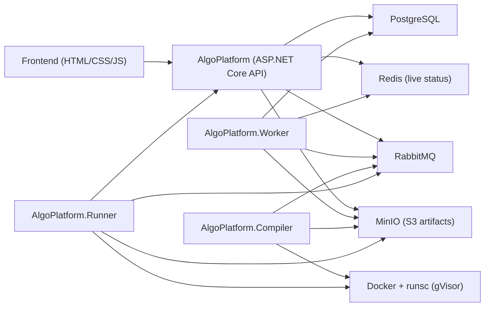

# Архитектура AlgoSim

## 1) Назначение системы

AlgoSim это платформа для запуска пользовательского C# кода алгоритмов в изолированном окружении с последующей визуализацией шагов алгоритма на фронтенде.

Система решает три задачи:

1. Безопасно выполнить пользовательский код.
2. Собрать подробные шаги выполнения (tracing).
3. Показать анимацию и таймлайн шагов в UI.

---

## 2) Высокоуровневый контур

---

## 3) Репозиторий и модули

### Backend (`AlgoPlatform.API`)

- `AlgoPlatform`:
  - ASP.NET Core Web API.
  - Контроллеры: `Submissions`, `Executions`, `Algorithms`, `Metrics`, `Diagnostics`.
- `AlgoPlatform.Application`:
  - use-case сервисы (`SubmissionsService`, `AlgorithmsService`).
  - абстракции репозиториев/очередей.
- `AlgoPlatform.Domain`:
  - доменные модели (`Submission`, `Artifact`, `Algorithm`).
- `AlgoPlatform.Infrastructure`:
  - PostgreSQL (EF Core), Redis, RabbitMQ, S3/MinIO, hosted services.
- `AlgoPlatform.Worker`:
  - фоновые consumer-процессы для orchestration-слоя.
- `AlgoPlatform.Compiler`:
  - компиляция кода в контейнере, упаковка артефактов, публикация compile result.
- `AlgoPlatform.Runner`:
  - запуск кода/артефактов в контейнере, heartbeats, cancel, run result.
- `AlgoPlatform.Contracts`:
  - контракты сообщений/DTO между сервисами.
- `AlgoTracing`:
  - трейсинг-библиотека для алгоритмов (`TrackedList`, `TrackedAdjacencyList`, `JsonConsoleTracer`, расширения событий).

### Frontend (`frontend`)

- `html/algorithms.html`: основная страница симулятора.
- `js/runner/runner.js`: submit/poll/cancel/result, парсинг raw шагов, playback.
- `js/runner/status-panel.js`: статус выполнения и тайминги этапов.
- `js/runner/raw-log-export.js`: экспорт сырых логов.
- `js/viz/*`: визуализация для авто/контролируемого режимов.
- `js/ui/*`: табы, layout, граф-редактор, легенда.
- `js/editor/templates.js`: шаблоны алгоритмов C#.

---

## 4) Инфраструктура (docker-compose)

Сервисы:

- `postgres` (PostgreSQL 16)
- `redis` (Redis 7)
- `rabbitmq` (RabbitMQ 3.13 + management)
- `minio` + `minio-init` (S3-совместимое хранилище)
- `api`
- `worker`
- `compiler`
- `runner`

Ключевой runtime:

- `runsc` (gVisor runtime) обязателен для `compiler` и `runner`.
- Скрипты:
  - `scripts/enable-runsc.ps1` - регистрирует `runsc` в Docker daemon.
  - `scripts/setup.ps1` - включает `runsc` и при `-Up` поднимает compose.

---

## 5) Данные и хранилища

### PostgreSQL

- Таблица submissions: код, input, output, статус, ошибки, время, hash артефакта.
- Таблица artifacts: hash, статус компиляции, storage key, hash версии tracing-библиотеки.

### Redis

- Быстрый live-статус выполнения (`SubmissionStatus`).
- Используется API polling endpoint-ом `GET /api/submissions/{id}/status`.

### MinIO (S3)

- Хранение скомпилированных артефактов (`artifacts/{hash}.tar.gz`).
- Позволяет избегать повторной компиляции одинакового кода.

---

## 6) Очереди и сообщения

RabbitMQ очереди:

- `submissions`
- `compile`
- `compile-results`
- `runs`
- `run-cancel`
- `run-results`
- `run-heartbeats`

Для каждой основной очереди создаются `*.retry` и `*.dead` с `x-retry`.

Основные контракты:

- `CompileJobMessage(SubmissionId, Code, ArtifactHash)`
- `CompileResultMessage(SubmissionId, ArtifactHash, Success, StorageKey, Error, DurationMs)`
- `RunJobMessage(SubmissionId, Code, Input, ArtifactKey)`
- `RunResultMessage(SubmissionId, ExitCode, Stdout, Stderr, DurationMs, TimedOut)`
- `SubmissionHeartbeatMessage(SubmissionId, State, Progress, Message)`

---

## 7) Цепочки событий (end-to-end)

## 7.1 Запуск алгоритма (обычный поток)

1. Пользователь нажимает `Run` во фронтенде.
2. `runner.js` собирает:
   - код из Monaco editor;
   - input payload (array/graph);
   - `POST /api/submissions`.
3. API (`SubmissionsController` + `SubmissionsService`):
   - сохраняет submission в PostgreSQL со статусом `Queued`;
   - пишет `Queued` в Redis;
   - публикует `submissionId` в очередь `submissions`;
   - возвращает `id` и `statusUrl`.
4. Фронтенд начинает polling `statusUrl` (раз в ~1 сек).

## 7.2 Оркестрация submission (worker)

`RabbitMqExecutorService` читает `submissions`:

1. Загружает submission.
2. Вычисляет `ArtifactHash` через `IArtifactHasher`:
   - hash кода;
   - hash текущей версии `AlgoTracing`.
3. Проверяет artifact cache:
   - если артефакт `Ready` и есть `StorageKey` -> `RunQueued` и публикация в `runs`;
   - если нет артефакта/он compiling -> `CompileQueued` и публикация в `compile`;
   - если artifact `Failed` -> submission `Failed`.

## 7.3 Компиляция

`RabbitMqCompileWorker`:

1. Берет job из `compile`.
2. Публикует heartbeat `Compiling` в `run-heartbeats`.
3. Компилирует в контейнере (`DockerCliCodeCompiler`) с sandbox-параметрами.
4. При успехе загружает tar.gz в MinIO.
5. Публикует `CompileResultMessage` в `compile-results`.

`RabbitMqCompileResultService`:

1. Обновляет artifact (`Ready`/`Failed`).
2. Находит все ожидающие submissions с тем же hash.
3. При успехе переводит их в `RunQueued` и отправляет `RunJobMessage` в `runs`.
4. При ошибке помечает их `Failed`.

## 7.4 Выполнение

`RabbitMqRunWorker`:

1. Берет job из `runs`.
2. Если есть предварительная отмена -> сразу публикует cancelled result.
3. Запускает heartbeat loop (`Running`) в `run-heartbeats`.
4. Выполняет:
   - `RunPrecompiledAsync` если есть `ArtifactKey`;
   - `RunAsync` если пришел raw code.
5. Публикует `RunResultMessage` в `run-results`.
6. Останавливает heartbeat и очищает active run state.

## 7.5 Фиксация результата и live-статуса

- `RabbitMqHeartbeatService`:
  - обновляет Redis статусы (`Compiling`, `Running`);
  - при необходимости отражает промежуточный статус в PostgreSQL.
- `RabbitMqResultService`:
  - сохраняет stdout/stderr/exitCode/duration в submission;
  - ставит финальный статус `Completed`/`Failed`;
  - пишет финальный статус в Redis.

## 7.6 Отмена выполнения

1. Пользователь нажимает `Stop`.
2. Фронтенд вызывает `POST /api/submissions/{id}/cancel`.
3. API:
   - ставит `Cancelled` в PostgreSQL и Redis;
   - публикует `id` в `run-cancel`.
4. `RabbitMqRunWorker`:
   - если run активен -> `CancellationTokenSource.Cancel()`;
   - если еще не стартовал -> флаг pre-cancel, при получении job вернется cancelled result.

---

## 8) Цепочка визуализации на фронтенде

1. После финального статуса фронтенд делает `GET /api/submissions/{id}`.
2. Берет `output` (raw stdout).
3. `parseStepPayloads()` вытаскивает шаги из строк `__STEP__{json}`.
4. Формируется `timelineStepItems`.
5. Playback (`LogPlayer`) подает шаги в `processPlaybackItem()`.
6. `window.handleStepEvent()` (viz-слой) анимирует текущий шаг.
7. UI обновляет:
   - таймлайн шагов;
   - счетчики текущего шага;
   - corner summary;
   - состояние play/pause/step/replay.

Важно:

- Сырые логи хранятся как есть для экспорта (`RawLogExport`).
- Для разных алгоритмов есть UI-фильтрация списка шагов (например, для `binary`) без изменения raw-потока, который использует анимация.

---

## 9) Графовые алгоритмы (BFS/DFS) в цепочке

1. Пользователь задает граф в `GraphEditor`.
2. В input отправляется JSON вида:
   - `type: "graph"`
   - `graph` (adjacency map)
   - `selection` (`start`, `end`)
3. Код алгоритма использует `TrackedAdjacencyList`, `TrackedVisited`, `TrackedQueue`/`TrackedStack`.
4. `GraphTracer` генерирует события `graphInit/node/edge/path/notFound`.
5. Фронтенд-визуализатор графа окрашивает вершины/ребра и показывает найденный путь.

---

## 10) Изоляция и безопасность выполнения

Пользовательский код выполняется в Docker контейнере с ограничениями:

- runtime: `runsc` (gVisor)
- `--network none`
- `--read-only`
- `tmpfs` для временных директорий
- `--cap-drop ALL`
- `--security-opt no-new-privileges`
- non-root user (`65532:65532`)
- лимиты CPU/RAM/PIDs
- timeout и обрезка вывода (`maxOutputChars`)

Эта модель минимизирует риск вредоносной нагрузки и изолирует выполнение от хоста.

---

## 11) Наблюдаемость и диагностика

- `GET /health` (API и Runner)
- `GET /api/diagnostics`:
  - PostgreSQL, Redis, RabbitMQ, S3 проверки;
  - проверка существования очередей.
- `GET /api/metrics/submissions`:
  - агрегированные метрики submissions.

---

## 12) Технологический стек

Backend:

- .NET 10
- ASP.NET Core Web API
- EF Core + Npgsql
- StackExchange.Redis
- RabbitMQ.Client
- AWS SDK S3 (с MinIO)
- System.Text.Json

Execution:

- Docker
- gVisor (`runsc`)
- `mcr.microsoft.com/dotnet/sdk:10.0-alpine`

Frontend:

- HTML5/CSS3
- Vanilla JavaScript (без SPA framework)
- Monaco Editor
- GSAP
- SVG-анимации и собственный viz engine

Infra/DevOps:

- Docker Compose
- PowerShell scripts для настройки runtime и запуска

---

## 13) Точки расширения

1. Добавление нового алгоритма:
   - шаблон в `frontend/js/editor/templates.js`;
   - визуализатор в `frontend/js/viz/...`;
   - (опционально) фильтры шагов в `runner.js`.
2. Новые типы tracing-событий:
   - добавить эмиссию в `AlgoTracing`;
   - добавить обработку в frontend viz.
3. Усиление песочницы:
   - whitelist/AST-проверки кода до отправки;
   - дополнительные ограничения build/run профиля.

